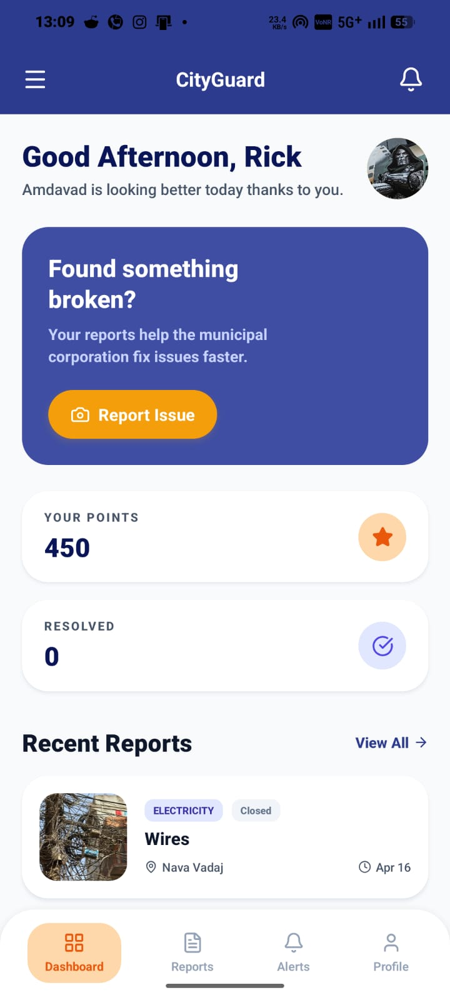
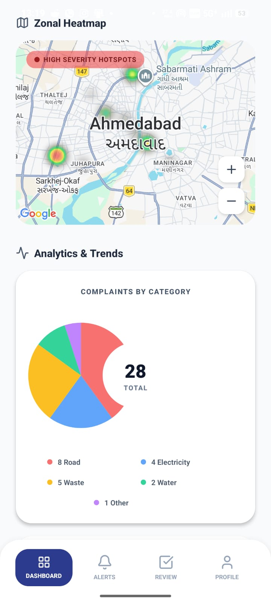
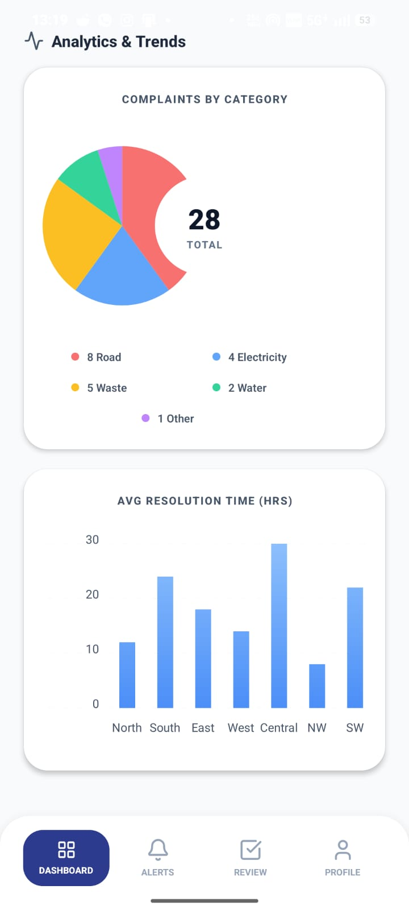
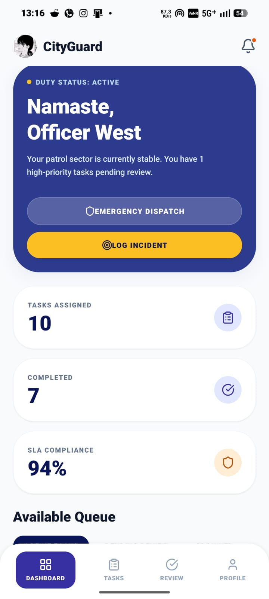
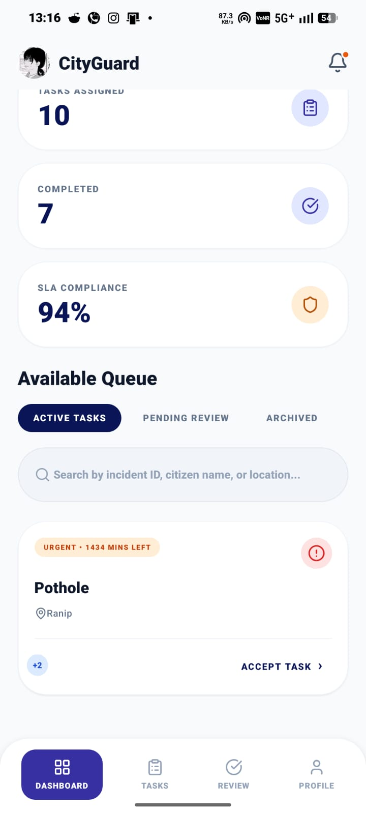
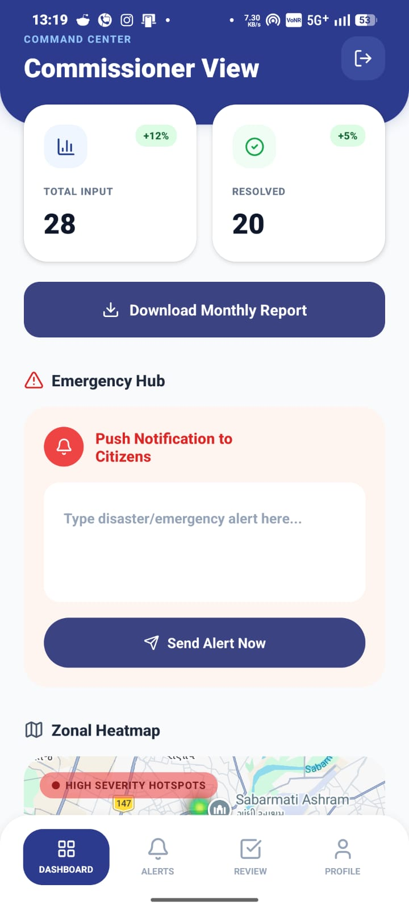

# 🏙️ City Guard — Smart City Governance Platform

> AI-powered smart city governance platform built with React Native, Node.js, MongoDB, and Gemini AI.

---

# 📱 Overview

City Guard is a **full-stack mobile platform** designed to improve communication between citizens and city administration.

The system allows citizens to report infrastructure issues like:

* Potholes
* Garbage problems
* Water leaks
* Broken streetlights

Reports are tracked from submission to completion with AI-assisted verification and role-based workflows.

Inspired by the **AMC (Ahmedabad Municipal Corporation)** zonal governance system. 

---

# ✨ Key Features

## 👥 Citizen Features

* Submit complaints with photos
* Live complaint tracking
* Earn points for valid reports
* Rate completed work

## 👮 Officer Features

* Zone-based complaint management
* Assign contractors
* Review completed tasks
* SLA monitoring

## 🔧 Contractor Features

* View assigned tasks
* Upload completion proof
* Submit work details

## 👨‍⚖️ Commissioner Features

* City-wide analytics dashboard
* Emergency broadcasts
* Report monitoring

---

# 🤖 AI Integration

City Guard uses **Google Gemini 2.5 Flash Vision** for:

### Report Verification

Checks whether uploaded images match the selected issue category.

### Completion Verification

Validates contractor “after repair” photos to reduce fake submissions.

---

# 🏗️ Architecture

```txt id="u5k0f2"
React Native App
      │
      ▼
Express.js REST API
      │
      ├── MongoDB Atlas
      ├── Cloudinary
      └── Gemini AI
```

---

# 🛠️ Tech Stack

## Frontend

* React Native
* Expo
* Expo Router
* NativeWind (Tailwind CSS)
* Axios
* AsyncStorage
* Expo Notifications

## Backend

* Node.js
* Express.js
* MongoDB + Mongoose
* JWT Authentication
* bcryptjs
* Cloudinary
* Multer
* Nodemailer

## Services

* MongoDB Atlas
* Google Gemini AI
* Cloudinary CDN

---

# 🔐 User Roles

| Role         | Permissions             |
| ------------ | ----------------------- |
| Citizen      | Create & track reports  |
| Officer      | Claim & manage reports  |
| Contractor   | Complete assigned tasks |
| Commissioner | Full city analytics     |
| Admin        | System setup            |

---

# 🔄 Report Workflow

```txt id="x80n4u"
Citizen submits report
        ↓
AI verifies image
        ↓
Officer claims task
        ↓
Contractor assigned
        ↓
Contractor uploads completion proof
        ↓
AI validates completion image
        ↓
Officer reviews & closes report
        ↓
Citizen rates work + earns points
```

---

# 📊 Core Modules

## Governance App

Main smart-city management application with:

* Complaint reporting
* Dashboards
* Notifications
* Analytics
* Role-based routing

## Backend API

Shared REST API for:

* Authentication
* Reports
* Notifications
* File uploads

---

# 🗃️ Database Models

Main collections:

* Users
* Reports
* Notifications

---

# 🛡️ Security

* JWT Authentication
* bcrypt password hashing
* Role-based access control
* Zone-level restrictions
* AI fraud prevention

---

# 📸 App Screenshots

## Citizen Dashboard



## Create Report Screen



## Officer Dashboard





## Commissioner Analytics



---

# 🚀 Running Locally

## 1. Install Dependencies

```bash id="pmvf7f"
npm install
```

## 2. Backend Setup

Create `.env` inside backend:

```env id="t6e11s"
MONGO_URI=your_mongodb_uri
JWT_SECRET=your_secret
GEMINI_API_KEY=your_key
CLOUDINARY_CLOUD_NAME=your_name
CLOUDINARY_API_KEY=your_key
CLOUDINARY_API_SECRET=your_secret
```

## 3. Start Backend

```bash id="hzl3hi"
cd backend
npm start
```

## 4. Start App

```bash id="6fvhjp"
cd app-governance
npx expo start
```

---

# 📄 License

Proprietary project — all rights reserved.
